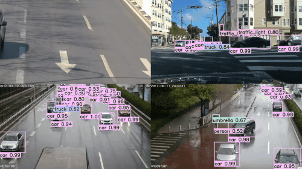

# CNStream Docker Images #

Build docker images for [CNStream](https://github.com/Cambricon/CNStream).

# Directory tree #

```bash
.
├── build-image-ubuntu16.04-cnstream.sh
├── load-image-ubuntu16.04-cnstream.sh
└── run-container-ubuntu16.04-cnstream.sh
```

# Clone #
```bash
git clone https://github.com/CambriconKnight/cnstream-docker-image.git
```

# Build #
```bash
#编译cnstream镜像
./build-image-ubuntu16.04-cnstream.sh
```

# Load #
```bash
#加载Docker镜像
./load-image-ubuntu16.04-cnstream.sh
```

# Run #
```bash
#启动Docker容器
./run-container-ubuntu16.04-cnstream.sh
```

# Test #
寒武纪 CNStream 开发样例为用戶提供了物体分类、检测、追踪等场景的编程样例。另外还提供了前处理、后处理、自定义模块以及如何使用非配置文件方式创建应用程序的样例源码。帮助用戶快速体验如何使用CNStream开发应用。用戶只需直接通过脚本运行样例程序，无需修改任何配置。

CNStream 开发样例主要包括 .json 文件和 .sh 文件，其中 .json 文件为样例的配置文件，用于声明 pipeline 中各个模块的上下游关系以及配置模块的参数。用戶可以根据自己的需求修改配置文件参数，完成应用开发。 .sh 文件为样例的运行脚本，通过运行该脚本来运行样例。

开发样例中的模型在运行样例时被自动加载，并且会保存在${CNSTREAM_DIR}/data/models目录下。下面以目标检测为例, 介绍如何运行CNStream提供的样例。
## YOLOv3 ##
使用 YOLOv3 网络预训练模型进行⽬标检测.
```bash
#硬件平台：MLU270、MLU220
#软件环境：Docker（image-ubuntu16.04-cnstream-v1.7.602.tar.gz）
#环境变量:${CNSTREAM_DIR}=${CNSTREAM_DIR},此环境变量在docker镜像中已设置,可直接使用
#运行实例：基于CNStream的YOLOv3运行实例
#业务流程：读取视频文件 --> MLU硬件解码 --> MLU硬件推理 --> 叠加OSD信息 --> RTSP推流输出
#所用插件：DataSource; Inferencer; Osd; RtspSink
#离线模型：http://video.cambricon.com/models/MLU270/yolov3/yolov3_offline_u4_v1.3.0.cambricon
#视频文件：${CNSTREAM_DIR}/data/videos/cars.mp4
#启动脚本：${CNSTREAM_DIR}/samples/cns_launcher/object_detection/run.sh
#        Usages: run.sh [mlu220/mlu270] [encode_jpeg/encode_video/display/rtsp/kafka]
#配置文件：${CNSTREAM_DIR}/samples/cns_launcher/object_detection/config_template.json
#后处理代码:${CNSTREAM_DIR}/samples/common/postprocess/postprocess_yolov3.cpp
#启动命令: cd ${CNSTREAM_DIR}/samples/cns_launcher/object_detection && ./run.sh mlu270 rtsp
#结果演示：执行启动命令后，脚本会自动下载检测模型, 之后按照 json 配置文件启动业务处理流程.
#        最后把检测后的结果通过 RTSP 服务模块推送出去.
```

**推理结果摘选：**
<table>
    <tr>
        <td ><center></td>
    </tr>
</table>
<table>
    <tr>
        <td ><center></td>
    </tr>
</table>